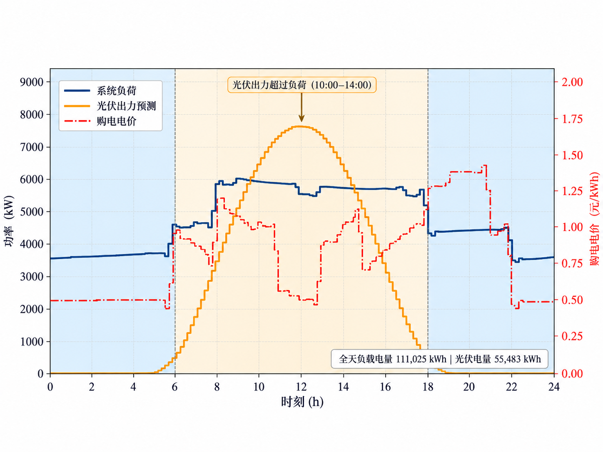
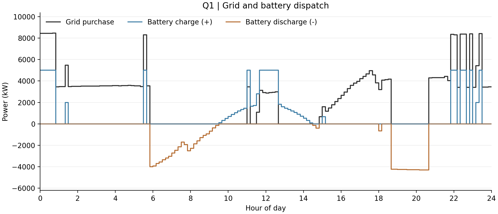
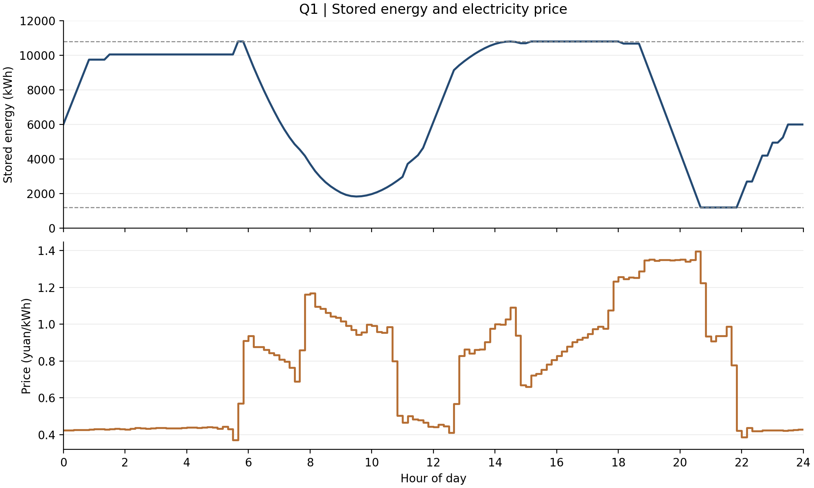

# C题第一问 微网单日购电与储能调度报告

**计算版本：**Q1_microgrid.ipynb 默认参数  
**报告日期：**2026年9月10日  
**计量口径：**功率单位为kW，区间电量与储能电量单位为kWh，费用单位为元

## 1 主要结论

在当前时间离散与储能参数假设下，联合优化全天144个时段的购电和充放电安排，可以将购电费用从 **48,052.0466元** 降至 **35,126.9486元**，节省 **12,925.0980元**，下降 **26.8981%**。优化方案的全天购电量为 **59,482.6990 kWh**，弃光量为零，并满足日初、日末储能电量均为6000 kWh的要求。

| 指标 | 结果 |
| --- | --- |
| 优化购电费（元） | 35,126.9486 |
| 无储能购电费（元） | 48,052.0466 |
| 节省购电费（元） | 12,925.0980 |
| 费用下降比例 | 26.8981% |
| 优化购电量（kWh） | 59,482.6990 |
| 弃光电量（kWh） | 0.0000 |

上述结果是**当前模型与假设下的最优解**。原数据采样时刻与结果模板的区间标签尚未统一解释，本报告暂将采样值视为此前10分钟区间的平均功率；因此，报告中的物理时间区间尚不能按行号直接映射到原始结果模板。若时间解释、效率定义或初始状态发生变化，应重新计算结果。

## 2 数据与建模口径

### 2.1 输入数据

第一问使用附件1给出的典型日电价、小区负载和光伏预测功率。经预处理后，数据包含144条记录，对应10分钟粒度；数值区域没有缺失值或负值。本问将给定的光伏预测视为确定性输入，不另行训练光伏预测模型。

记第 \(t\) 个时段为：

$$
I_t=\left[(t-1)\Delta t,t\Delta t\right),\qquad
t=1,\ldots,144,\qquad \Delta t=\frac16\ \mathrm{h}.
$$

将负载与光伏功率转换为区间电量近似：

$$
L_t=P_t^{\mathrm{load}}\Delta t,\qquad
V_t=P_t^{\mathrm{PV}}\Delta t.
$$

本次输入对应的全天负载电量为 **111,024.8081 kWh**，光伏电量为 **55,482.8357 kWh**。计算使用完整浮点精度，仅在报告展示时统一保留四位小数。

### 2.2 模型假设

1. **时间与功率近似。**将记录时刻 \(t\) 的功率和电价用于其之前的10分钟区间。其中，功率被近似为该区间平均功率，电价在区间内按给定值计费。
2. **储能效率。**充电效率与放电效率分别取 \(\eta_c=\eta_d=0.9\)，对应一次完整充放电过程的效率乘积为0.81。
3. **初末状态。**第一问典型日的初始储能固定为6000 kWh，并要求24:00回到6000 kWh。附录给出的2025年1月1日初始电量在本次典型日计算中作为初值使用。
4. **电力流向。**允许未利用的光伏形成弃光，不向外网售电。电池充电可以使用光伏或外网电量；模型不额外区分两者在电池内部的来源。
5. **设备与费用。**使用题面容量和功率限制；未额外引入电池退化、自放电、充放电切换费用或未给定的外网购电功率上限。

题面没有给定负荷不满足时的容许比例，因此模型要求每个时段都满足负载。第一问也不使用后续问题中的紧急购电或计划调整费用。

## 3 符号定义

| 符号 | 含义 | 单位或类型 |
|---|---|---|
| \(p_t\) | 时段 \(t\) 的已知购电价格 | 元/kWh |
| \(L_t\) | 时段 \(t\) 的负载电量 | kWh |
| \(V_t\) | 时段 \(t\) 的光伏预测电量 | kWh |
| \(g_t\) | 从外网购入的电量 | kWh，非负 |
| \(c_t\) | 经设备外部端口输入的充电电量 | kWh，非负 |
| \(d_t\) | 经设备外部端口输出的放电电量 | kWh，非负 |
| \(w_t\) | 未利用的光伏电量 | kWh，非负 |
| \(E_t\) | 时段 \(t\) 结束时的储能电量 | kWh |
| \(E_0\) | 00:00的初始储能电量 | kWh |
| \(z_t\) | 储能充电模式变量 | 0或1 |
| \(\eta_c,\eta_d\) | 充电效率、放电效率 | 无量纲 |

充电量、放电量均在电池外部端口计量。例如，输入100 kWh充电，内部储能增加90 kWh；向外输出90 kWh，则内部储能减少100 kWh。

## 4 优化模型

### 4.1 目标函数

以全天购电费用最小为目标：

$$
\boxed{\min F=\sum_{t=1}^{144}p_tg_t.}
$$

该目标不直接最小化购电量，也不惩罚充放电频次，因此结果解释应围绕购电费用展开。

### 4.2 区间电量平衡

$$
\boxed{g_t+V_t+d_t=L_t+c_t+w_t,\qquad t=1,\ldots,144.}
$$

左侧表示购电、光伏和储能放电提供的电量，右侧表示负载、充电与弃光。进一步规定：

$$
g_t\ge0,\qquad 0\le w_t\le V_t.
$$

引入弃光变量可以处理光伏过剩而电池又无法继续吸收电量的情况，同时保证弃光不超过实际可用的光伏电量。

### 4.3 储能状态更新

$$
\boxed{E_t=E_{t-1}+\eta_c c_t-\frac{d_t}{\eta_d}.}
$$

代入本次效率假设可得：

$$
E_t=E_{t-1}+0.9c_t-\frac{d_t}{0.9}.
$$

这里放电项除以0.9，表示向负载输出一定电量时，电池内部需要额外消耗一部分电量来覆盖损耗。

### 4.4 容量及功率约束

储能电量必须满足：

$$
1200\le E_t\le10800,\qquad t=0,\ldots,144.
$$

最大充、放电功率均为5000 kW，因此每个10分钟区间：

$$
0\le c_t\le M_c,\qquad 0\le d_t\le M_d,
$$

$$
M_c=M_d=5000\Delta t=\frac{5000}{6}\ \mathrm{kWh}.
$$

功率限制仅适用于储能设备，不能据此把小区负载、光伏或外网购电都截断到5000 kW。

### 4.5 初末储能约束

$$
\boxed{E_0=E_{144}=6000.}
$$

这一条件使储能在一天结束后恢复初始状态，避免通过消耗初始库存而低估可持续运行的购电费用。

### 4.6 充放电互斥

为禁止同一时段同时充电和放电，增加二元变量：

$$
z_t\in\{0,1\},\qquad
0\le c_t\le M_cz_t,\qquad
0\le d_t\le M_d(1-z_t).
$$

当 \(z_t=1\) 时允许充电，当 \(z_t=0\) 时允许放电；两种模式均允许设备闲置。包含这些二元变量的模型为混合整数线性规划，即MILP。

## 5 求解方法与最优性依据

程序使用SciPy提供的HiGHS接口。为降低求解负担，先去掉充放电互斥条件，求解连续线性规划松弛；随后逐时段检查充电量和放电量是否同时超过数值容差。

连续模型将变量按 \([g,c,d,w,E]\) 排列，共有：

$$
4\times144+145=721
$$

个连续变量，并构造144条供需平衡等式和144条储能更新等式。初末状态和设备限制通过变量上下界实现。若需要严格求解MILP，再增加144个二元变量和相应模式约束。

本次LP最优解中，同时充放电的时段数为零。因此，该解也是严格MILP模型的可行解。记LP与MILP的最优费用分别为 \(F_{\mathrm{LP}}^\star\)、\(F_{\mathrm{MILP}}^\star\)，则：

$$
F_{\mathrm{LP}}^\star\le F_{\mathrm{MILP}}^\star.
$$

由于LP最优解本身满足MILP约束，反过来有：

$$
F_{\mathrm{MILP}}^\star\le F_{\mathrm{LP}}^\star.
$$

两者最优值因此相等。本次报告的最优性来自**LP求解器报告的最优值与互斥可行性检查**，在数值容差范围内成立。若其他参数或数据下出现同时充放电，Notebook会改用二元变量求解MILP，而不沿用当前判断。

## 6 数值结果

### 6.1 指定时段的购电量

| 时间段 | 计划购电量（kWh） |
| --- | --- |
| 10:00–10:10 | 0.0000 |
| 12:00–12:10 | 480.4125 |
| 14:00–14:10 | 0.0000 |
| 16:00–16:10 | 445.4317 |
| 18:00–18:10 | 531.8941 |
| 20:00–20:10 | 0.0000 |
| 全天购电量 | 59,482.6990 |
| 全天购电费（元） | 35,126.9486 |

这里的10:00–10:10表示物理时间区间，不表示原始模板中已经确认的行位置。表内时段结果按照当前的前区间采样近似计算。

### 6.2 每四小时的充放电量

| 时间段 | 充电量（kWh） | 放电量（kWh） | 期初储电量（kWh） | 期末储电量（kWh） |
| --- | --- | --- | --- | --- |
| 00:00–04:00 | 4,500.0000 | 0.0000 | 6,000.0000 | 10,050.0000 |
| 04:00–08:00 | 833.3333 | 6,365.8412 | 10,050.0000 | 3,726.8431 |
| 08:00–12:00 | 4,787.9643 | 1,702.9970 | 3,726.8431 | 6,143.7921 |
| 12:00–16:00 | 5,286.0352 | 91.1014 | 6,143.7921 | 10,800.0000 |
| 16:00–20:00 | 0.0000 | 5,780.1319 | 10,800.0000 | 4,377.6312 |
| 20:00–24:00 | 5,333.3333 | 2,859.8681 | 4,377.6312 | 6,000.0000 |

00:00与24:00储能电量均为6000.0000 kWh。4小时区间内同时出现非零充电量和放电量，表示其内部不同10分钟时段分别执行充电、放电，并不违反逐时段互斥。

### 6.3 与无储能方案比较

无储能基线仍使用光伏满足负载，仅将不足部分向外网购买：

$$
g_t^{\mathrm{base}}=\max(L_t-V_t,0).
$$

当光伏超过负载时，其剩余电量在这一基线中被弃用。基线与优化方案使用完全相同的负载、光伏、电价和时间离散口径。

| 策略 | 购电量（kWh） | 购电费（元） | 弃光量（kWh） |
| --- | --- | --- | --- |
| 无储能 | 61,789.9354 | 48,052.0466 | 6,247.9630 |
| 优化储能调度 | 59,482.6990 | 35,126.9486 | 0.0000 |

优化后购电量比无储能方案减少 **2,307.2364 kWh**，降幅约 **3.7340%**；购电费用的降幅则为 **26.8981%**。因此，费用改善既包含利用原本被弃用的光伏，也包含将部分购电需求转移至较低电价时段。

### 6.4 全天能量核对

优化方案的全天充电量为 **20,740.6661 kWh**，放电量为 **16,799.9396 kWh**，二者差额 **3,940.7266 kWh** 为本模型在日初日末电量相同条件下的充放电损耗。

在弃光为零的情况下，全天电量满足：

$$
\sum_t g_t
=\sum_t L_t-\sum_t V_t+\sum_t(c_t-d_t).
$$

使用报告显示精度代入：

$$
59{,}482.6990
\approx111{,}024.8081-55{,}482.8357+3{,}940.7266.
$$

这也解释了为什么优化购电量仍高于“负载电量减光伏电量”的简单差值。它并不与“相较无储能方案购电量下降”矛盾，因为无储能基线存在弃光。

## 7 图表与策略解释

### 7.1 负载与光伏

**图1说明：**白天光伏功率呈明显峰形，中午部分时段超过小区负载，形成可用于充电的剩余电量。夜间光伏接近零，负载需要依靠外网与储能供电。仅比较全天发用电总量无法确定最优调度，还必须考虑供需在时间上的分布。

### 7.2 购电与充放电动作

**图2说明：**黑线为外网购电功率，蓝线为充电功率，棕线在负方向表示放电功率。图中负方向仅用于区分充放电动作，实际放电决策变量 \(d_t\) 仍为非负值。

最优安排会在较便宜的时段购电充电，并在后续较贵时段释放电量。午间即使有光伏，也可能出现额外购电充电，这取决于当前价格、后续价格、未来光伏和储能剩余容量之间的关系，不能用“有光伏就绝不购电”的固定规则替代优化。

本模型不限制外网购电功率，因此购电曲线超过5000 kW不代表违反储能功率上限。充电和放电本身仍分别受5000 kW约束。

### 7.3 储能状态与电价

**图3说明：**上图是145个边界时刻的储能电量，虚线标示1200与10800 kWh边界；下图是各时段电价。储能轨迹在日内保持连续，并在24:00回到6000 kWh。

由于效率损失，仅有“后一个时段电价更高”不足以保证套利值得执行。在没有其他约束干扰的简化情况下，买入1 kWh电量经完整充放电后最多输出0.81 kWh，跨时段转移需要比较买入价格与0.81倍的未来替代购电价格。完整优化模型同时考虑了这一损耗、容量边界和光伏供需。

## 8 结果验证

Notebook对供需平衡、储能状态、非负性、功率、容量、初末状态、弃光和费用下界进行检查。除矩阵求解外，程序还使用原始物理关系重新计算储能演化，避免只依赖求解器返回的成功状态。

| 校验项目 | 实际结果 | 判定 |
| --- | --- | --- |
| 最大供需平衡残差 | 2.274e-13 kWh | 通过 |
| 最大储能更新残差 | 8.313e-13 kWh | 通过 |
| 储能电量范围 | 1,200.0000–10,800.0000 kWh | 通过 |
| 最大充电功率 | 5,000.0000 kW | 通过 |
| 最大放电功率 | 4,293.9182 kW | 通过 |
| 日初储能电量 | 6,000.0000 kWh | 通过 |
| 日末储能电量 | 6,000.0000 kWh | 通过 |
| 同时充放电时段数 | 0 | 通过 |
| 负购电及其他负决策 | 0 个时段 | 通过 |

默认物理检查容差为 \(10^{-6}\)，分别按对应的kWh、kW或元单位比较。供需与储能演化残差远小于该容差，说明输出在数值上满足所建立模型。单独脚本的26项结果校验也已通过；报告数值和图表以Notebook保存的结果为准。

这些检查证明的是**既定模型中的数值可行性与费用一致性**，不能替代对时间口径、效率解释或实际设备条件的确认。

## 9 当前结论的适用范围

### 9.1 时间标签仍需统一

原输入每天从00:10记录到次日00:00，而原结果模板的区间标签从00:10–00:20开始，末尾还出现次日区间，和题面按00:00–24:00调度的要求存在偏差。本次保留原始采样时刻，将其映射至此前10分钟区间，形成报告中的完整物理时间轴。

在最终提交前，应明确采样值是时刻功率还是区间平均功率，并统一数据、图表、指定时段和结果模板的时间映射。当前不能仅因为行数相同就按位置直接填表。

### 9.2 效率与初始状态会影响数值

当前采用充电和放电效率各90%，并固定典型日初始电量为6000 kWh。如果90%被解释为完整往返效率，或典型日初始状态采用其他处理，必须重新定义参数并求解。当前最优费用不能直接移用于不同口径。

### 9.3 第一问结果不能直接视为全年实际运行效果

本问把光伏预测作为确定性输入，尚未计入预测误差、负载变化、紧急购电、计划调整和波动电价的信息可得性。这些因素属于后续问题。26.8981%的费用下降仅对应本次典型日及当前对照基线。

### 9.4 方案没有惩罚频繁切换

目标函数只包含购电费用，因此可能在相邻区间出现变化较快的充放电动作。若将其用于真实设备，需要进一步考虑功率变化速度、切换或退化成本；这些参数题面未提供，本报告未擅自引入，也未给出相关敏感性实验结论。

## 10 复现依据与交付对应

| 文件或资料 | 本报告中的作用 |
|---|---|
| C题题面第一问及附录1 | 任务、容量、功率、效率及初始状态依据 |
| 附件1.xlsx | 典型日电价、负载与光伏预测来源 |
| q1_typical_day.csv | 保留来源数值的144时段标准输入 |
| Q1_microgrid.ipynb | 参数、模型构造、求解、校验、表格与绘图 |
| q1_notebook_results/dispatch_10min.csv | 144时段完整调度结果 |
| q1_notebook_results/paper_table1.csv | 指定时段购电量 |
| q1_notebook_results/paper_table2.csv | 四小时充放电及边界储能汇总 |
| q1_notebook_results/strategy_comparison.csv | 无储能对照与优化方案比较 |
| q1_notebook_results/summary.json | 费用、参数与校验状态 |

本报告中的三张图分别对应Notebook输出的01_load_pv.png、02_dispatch.png、03_storage_price.png。使用包含figures文件夹的完整报告包时，Markdown中的相对图片链接可以直接显示。

**复现顺序：**在cumcm2026环境打开Q1_microgrid.ipynb，从头执行全部单元格，先确认物理检查全部通过，再核对费用与表格。修改任何参数后应重跑后续计算，不能继续使用旧图或旧结果。

当前已完成第一问的模型、数值解、对照分析与验证。正式结果模板的导出应在时间口径统一后进行。
