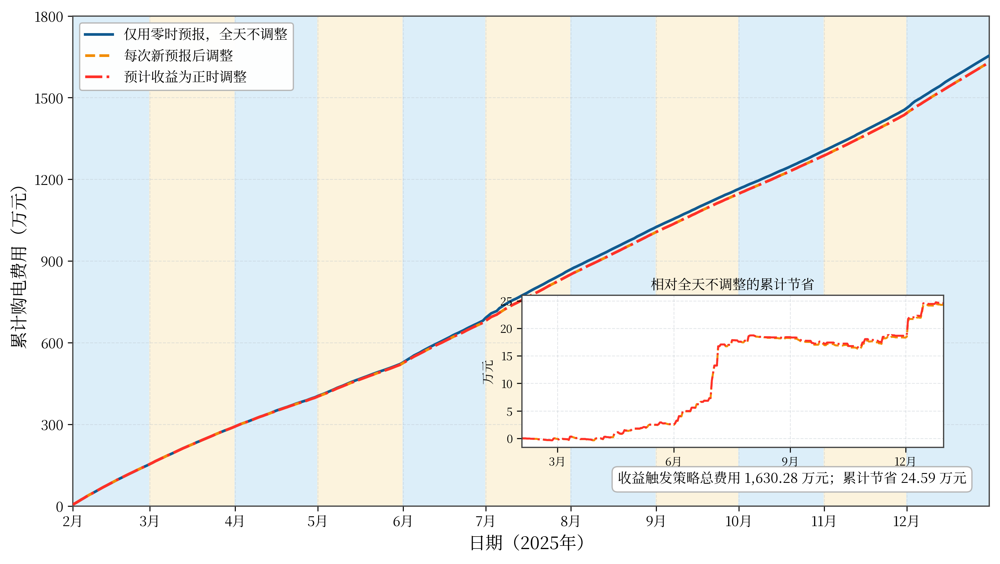
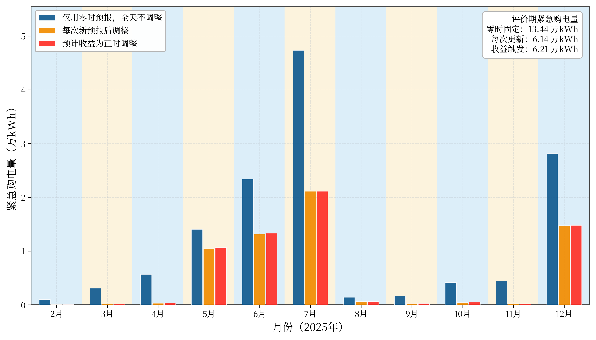
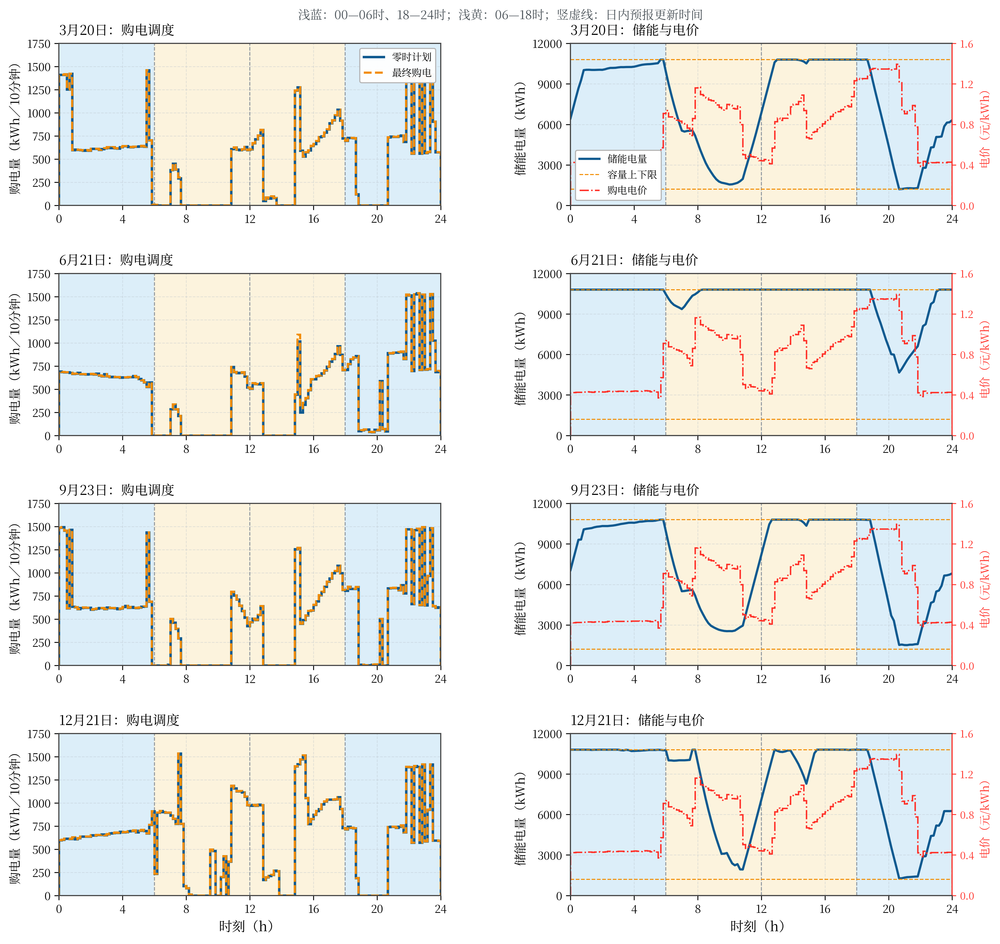

# 第三问：光伏预报驱动的日内购电调整

## 1. 结果与范围

本版本建立“00:00预报制定计划—06/12/18时更新—实时储能执行—分项结算”的因果运行模型。2025年1月从题面初始电量6000 kWh连续预热，统计2—12月334天、48,096个十分钟时段。结果是固定策略的历史回测，不是未知未来下的全局最优。

主结算口径：全部凌晨计划电费照付；减购另付0.5倍违约费，增购部分支付1.5倍费用，应急购电支付5倍费用。减购退费的另一种解释单列敏感性结果，不能混入主结果。

| 策略 | 计划费（元） | 调整费（元） | 应急费（元） | 总费（元） | 应急电量（kWh） |
| --- | --- | --- | --- | --- | --- |
| 仅00时预报，不调整 | 15,710,565.8133 | 0.0000 | 838,129.2642 | 16,548,695.0775 | 134,392.9296 |
| 每次新预报后调整 | 15,706,505.1016 | 234,860.3876 | 364,424.4962 | 16,305,789.9853 | 61,436.5933 |
| 预计收益为正才调整 | 15,706,592.7590 | 227,755.4821 | 368,463.1318 | 16,302,811.3729 | 62,102.6835 |
| 减购退费口径敏感性 | 15,706,628.1413 | -159,948.5085 | 380,576.8679 | 15,927,256.5007 | 64,057.4230 |

收益触发策略相对只用00时预报，费用变化为 **-245,883.7046元**；节省比例 **1.4858%**。相对每次新预报都调整，差额为 **-2,978.6124元**。

## 2. 数据与信息边界

- 附件1：每天重复使用的144个电价；附件2：实际负载、实际光伏；附件3：每日00、06、12、18时发布的光伏预报。不使用附件4。
- 实际数据来自第二问逐项核对后的输入。预报来自预处理包的按版本独立插值表；每次发布版本独立保留。
- 样本时刻暂按此前10分钟区间平均功率解释，能量=kW/6。预报整点之间线性插值，首段锚点只使用发布时已经可知观测；不可用时沿用预处理的首小时平坦回退规则。插值是近似，不是新增官方预报。
- 当前发布预报仅用于发布之后的区间。未来发布版本和当前时刻之后的实际观测不能进入决策。
- 历史情景只使用此前完整日期；当日早些时候的负载尚未用于更新负载预测，但实际储能状态实时更新。
- 预报虽然覆盖未来24小时，本初版仅优化至当天24时，跨午夜预报不进入目标；计划末态6000 kWh是策略设定。

## 3. 历史误差情景

对当前日期d、发布时间r，取此前最多28个完整日期s：

$$\epsilon_{s,r,t}=P^{actual}_{s,t}-\widehat P_{s,r,t},$$

$$P^{(s)}_{d,r,t}=\max(0,\widehat P_{d,r,t}+\epsilon_{s,r,t}),\qquad
N^{(s)}_{d,r,t}=(L_{s,t}-P^{(s)}_{d,r,t})/6.$$

历史负载曲线与同一天同一发布时间的光伏误差保持配对，情景等权。非负截断仅施加于模拟光伏，不改动原始数据。最近28天能近似代表当前条件是统计假设；极端天气和季节转折时可能失效。未根据2—12月结果选择窗口或触发阈值。

## 4. 00时计划模型

令g为凌晨购电量，c、d为共同计划充放电量，E为计划储能状态，h为情景下假设的应急量：

$$\min\sum_t p_tg_t+\frac1S\sum_{s,t}5p_th_{s,t}$$

$$g_t+d_t+h_{s,t}-c_t\ge N^{(s)}_t,\quad g_t,h_{s,t}\ge0,$$

$$E_{t+1}=E_t+0.9c_t-d_t/0.9,\quad1200\le E_t\le10800,$$

$$0\le c_t,d_t\le5000/6,\quad c_td_t=0.$$

初态取真实连续传递状态，计划末态6000。LP松弛解检查互斥；若发生同时充放电则回退MILP。这些变量只服务于近似目标，不能当作已经发生的实际结果。

## 5. 日内调整模型与结算

本策略每次只改变紧接着的6小时区间：06时调整06—12时，12时调整12—18时，18时调整18—24时。00—06时保持原计划。每个时段最多修改一次，未来更远时段暂保持凌晨计划，已执行时段固定。**这是可行策略限制，不是题目要求只能调整6小时。**

优化仍覆盖当前时刻到24时，以免把6小时块当作孤立问题。对可调整块：

$$q_t=g_t+u_t-v_t,\quad u_t,v_t\ge0,\quad q_t\ge0.$$

不可调整的剩余时段固定q=g。主口径调整费用为：

$$A(q,g)=\sum_t[1.5p_t(q_t-g_t)^++0.5p_t(g_t-q_t)^+].$$

日内优化目标是调整费加情景平均应急费；已经确定的计划费是常数：

$$\min A(q,g)+\frac1S\sum_{s,t}5p_th_{s,t}.$$

储能和供电约束沿用上节，初态换为当前真实储能状态。在线性化中u和v系数之和为正，因此不会通过同时增加二者降低目标。

实际结算：

$$F=\sum_t p_tg_t+A(q,g)+\sum_t5p_th^{actual}_t.$$

例如原计划100 kWh、电价1元：减到80 kWh时计划费100、违约费10，共110元；增到120 kWh时共130元（未含应急费）。若采用“退还减购原价，再收50%违约费”的解释，则减到80时为90元，A中减购系数改为−0.5。本报告对该口径重新优化、重新回测，不只对旧轨迹改账。

主口径下减购没有电费回收且允许未利用余电，通常缺少主动减购的经济动机；减购量应结合这一点解释，不能认为算法漏实现减购。

## 6. 三种策略与触发判断

1. 仅使用00时预报制定计划，全天保持g。
2. 每次更新求解上述含调整费的模型，接受候选q；并不强制每次购电量必须改变。
3. 生成相同候选，再用与真实执行相同的储能控制器，在当前历史情景上分别模拟保持原计划与采用候选，只有预计节省大于0元时才接受。

$$B=\widehat F_{controller}(g)-\widehat F_{controller}(q),\qquad B>0\Rightarrow接受.$$

比较使用相同情景、当前状态和剩余日长度，费用包含候选的调整代价，不使用未来实际值。触发器旨在缓解“优化的共同储能计划”和“实际实时储能规则”之间的不一致，但预计节省为正并不保证真实当天节省。真实控制：余电优先充电、缺口优先放电、不足应急购买，剩余电量连续传到次日。

## 7. 回测对比与是否使用其他时刻预报

| 发布时间 | 接受候选次数 | 实际发生变更次数 |
| --- | --- | --- |
| 6 | 92 | 92 |
| 12 | 110 | 110 |
| 18 | 26 | 26 |

三组主策略使用相同原始数据、相同历史窗口和结算规则，并各自从1月1日连续运行。每天的原计划可随各自实际初态变化。费用比较评价的是整套闭环策略，不能把全部差额单独归因于某一个模型组件。

不能由“预报更新了”直接推出“应当调整”。是否引入其他时刻预报应依据真实总费（包含调整费）、应急电量和储能约束综合判断。本次比较不证明日内预报在所有控制器、结算口径和未来年份中都产生同样收益。本次四组策略全年末态均为6080.9104 kWh，无需用不同末态解释费用差异；未另行折价结算。

## 8. 四个指定日期的结果

指定10分钟时段同时列出凌晨计划与最终调整量；全天费用按计划、调整、应急三项相加。充放电量为实际执行，连续应急区间按天合并。金额和电量下表保留四位小数。

### 2025-03-20

| 时段 | 凌晨计划(kWh) | 最终调整(kWh) |
| --- | --- | --- |
| 10:00-10:10 | 0.0000 | 0.0000 |
| 12:00-12:10 | 604.9616 | 604.9616 |
| 14:00-14:10 | 0.0000 | 0.0000 |
| 16:00-16:10 | 664.3627 | 664.3627 |
| 18:00-18:10 | 697.3552 | 697.3552 |
| 20:00-20:10 | 0.0000 | 0.0000 |

| metric | value |
| --- | --- |
| planned_grid_kwh | 72,347.6745 |
| adjusted_grid_kwh | 72,357.5556 |
| charge_kwh | 21,253.6762 |
| discharge_kwh | 17,331.2246 |
| emergency_kwh | 15.6095 |
| unused_kwh | 6,241.7517 |
| planned_cost_yuan | 44,091.8320 |
| adjustment_cost_yuan | 10.2255 |
| emergency_cost_yuan | 108.8922 |
| total_cost_yuan | 44,210.9497 |
| initial_storage_kwh | 6,444.9008 |
| terminal_storage_kwh | 6,316.2932 |

| date | interval | charge_kwh | discharge_kwh | storage_start_kwh | storage_end_kwh |
| --- | --- | --- | --- | --- | --- |
| 2025-03-20 | 00:00-04:00 | 4,280.7631 | 19.8395 | 6,444.9008 | 10,275.5437 |
| 2025-03-20 | 04:00-08:00 | 672.0050 | 5,621.6666 | 10,275.5437 | 4,634.0521 |
| 2025-03-20 | 08:00-12:00 | 5,888.7647 | 2,777.3772 | 4,634.0521 | 6,847.9656 |
| 2025-03-20 | 12:00-16:00 | 4,705.6219 | 254.7228 | 6,847.9656 | 10,800.0000 |
| 2025-03-20 | 16:00-20:00 | 10.8726 | 5,734.1999 | 10,800.0000 | 4,438.4521 |
| 2025-03-20 | 20:00-24:00 | 5,695.6489 | 2,923.4186 | 4,438.4521 | 6,316.2932 |

紧急购电：
| interval | emergency_kwh |
| --- | --- |
| 20:30-20:40 | 15.6095 |

### 2025-06-21

| 时段 | 凌晨计划(kWh) | 最终调整(kWh) |
| --- | --- | --- |
| 10:00-10:10 | 0.0000 | 0.0000 |
| 12:00-12:10 | 503.9828 | 503.9828 |
| 14:00-14:10 | 0.0000 | 0.0000 |
| 16:00-16:10 | 606.6250 | 606.6250 |
| 18:00-18:10 | 708.6660 | 708.6660 |
| 20:00-20:10 | 56.3979 | 56.3979 |

| metric | value |
| --- | --- |
| planned_grid_kwh | 69,281.8563 |
| adjusted_grid_kwh | 69,426.2903 |
| charge_kwh | 8,424.7071 |
| discharge_kwh | 6,824.0128 |
| emergency_kwh | 0.0000 |
| unused_kwh | 48,490.8555 |
| planned_cost_yuan | 43,981.8418 |
| adjustment_cost_yuan | 149.6632 |
| emergency_cost_yuan | 0.0000 |
| total_cost_yuan | 44,131.5050 |
| initial_storage_kwh | 10,800.0000 |
| terminal_storage_kwh | 10,800.0000 |

| date | interval | charge_kwh | discharge_kwh | storage_start_kwh | storage_end_kwh |
| --- | --- | --- | --- | --- | --- |
| 2025-06-21 | 00:00-04:00 | 0.0000 | 0.0000 | 10,800.0000 | 10,800.0000 |
| 2025-06-21 | 04:00-08:00 | 1,373.4798 | 1,297.7091 | 10,800.0000 | 10,594.2328 |
| 2025-06-21 | 08:00-12:00 | 228.6302 | 0.0000 | 10,594.2328 | 10,800.0000 |
| 2025-06-21 | 12:00-16:00 | 0.0000 | 0.0000 | 10,800.0000 | 10,800.0000 |
| 2025-06-21 | 16:00-20:00 | 0.0000 | 3,800.6361 | 10,800.0000 | 6,577.0710 |
| 2025-06-21 | 20:00-24:00 | 6,822.5971 | 1,725.6676 | 6,577.0710 | 10,800.0000 |

紧急购电：
无，0 kWh。

### 2025-09-23

| 时段 | 凌晨计划(kWh) | 最终调整(kWh) |
| --- | --- | --- |
| 10:00-10:10 | 0.0000 | 0.0000 |
| 12:00-12:10 | 469.4574 | 469.4574 |
| 14:00-14:10 | 0.0000 | 0.0000 |
| 16:00-16:10 | 655.7885 | 655.7885 |
| 18:00-18:10 | 808.0662 | 808.0662 |
| 20:00-20:10 | 0.0000 | 0.0000 |

| metric | value |
| --- | --- |
| planned_grid_kwh | 74,768.2217 |
| adjusted_grid_kwh | 74,768.2217 |
| charge_kwh | 19,900.5150 |
| discharge_kwh | 16,333.6104 |
| emergency_kwh | 6.3750 |
| unused_kwh | 9,091.0765 |
| planned_cost_yuan | 47,081.4808 |
| adjustment_cost_yuan | 0.0000 |
| emergency_cost_yuan | 42.9962 |
| total_cost_yuan | 47,124.4770 |
| initial_storage_kwh | 7,058.9668 |
| terminal_storage_kwh | 6,820.9744 |

| date | interval | charge_kwh | discharge_kwh | storage_start_kwh | storage_end_kwh |
| --- | --- | --- | --- | --- | --- |
| 2025-09-23 | 00:00-04:00 | 3,910.0658 | 8.1806 | 7,058.9668 | 10,568.9365 |
| 2025-09-23 | 04:00-08:00 | 354.4566 | 5,619.7590 | 10,568.9365 | 4,643.7707 |
| 2025-09-23 | 08:00-12:00 | 6,293.0811 | 1,896.6157 | 4,643.7707 | 8,200.1929 |
| 2025-09-23 | 12:00-16:00 | 3,386.9769 | 403.6249 | 8,200.1929 | 10,800.0000 |
| 2025-09-23 | 16:00-20:00 | 19.8512 | 5,582.0836 | 10,800.0000 | 4,615.5509 |
| 2025-09-23 | 20:00-24:00 | 5,936.0835 | 2,823.3465 | 4,615.5509 | 6,820.9744 |

紧急购电：
| interval | emergency_kwh |
| --- | --- |
| 20:20-20:30 | 6.3750 |

### 2025-12-21

| 时段 | 凌晨计划(kWh) | 最终调整(kWh) |
| --- | --- | --- |
| 10:00-10:10 | 0.0000 | 0.0000 |
| 12:00-12:10 | 970.0151 | 970.0151 |
| 14:00-14:10 | 0.0000 | 0.0000 |
| 16:00-16:10 | 873.9510 | 873.9510 |
| 18:00-18:10 | 715.6143 | 715.6143 |
| 20:00-20:10 | 0.0000 | 0.0000 |

| metric | value |
| --- | --- |
| planned_grid_kwh | 90,790.6372 |
| adjusted_grid_kwh | 90,790.6372 |
| charge_kwh | 19,631.8667 |
| discharge_kwh | 19,987.1260 |
| emergency_kwh | 5.4367 |
| unused_kwh | 2,113.5514 |
| planned_cost_yuan | 59,206.0945 |
| adjustment_cost_yuan | 0.0000 |
| emergency_cost_yuan | 31.5791 |
| total_cost_yuan | 59,237.6736 |
| initial_storage_kwh | 10,800.0000 |
| terminal_storage_kwh | 6,260.7622 |

| date | interval | charge_kwh | discharge_kwh | storage_start_kwh | storage_end_kwh |
| --- | --- | --- | --- | --- | --- |
| 2025-12-21 | 00:00-04:00 | 82.8793 | 150.2660 | 10,800.0000 | 10,707.6291 |
| 2025-12-21 | 04:00-08:00 | 1,006.6512 | 1,565.5870 | 10,707.6291 | 9,874.0741 |
| 2025-12-21 | 08:00-12:00 | 5,898.7864 | 7,283.5652 | 9,874.0741 | 7,090.1316 |
| 2025-12-21 | 12:00-16:00 | 7,052.3814 | 2,373.5473 | 7,090.1316 | 10,800.0000 |
| 2025-12-21 | 16:00-20:00 | 23.7338 | 5,761.8462 | 10,800.0000 | 4,419.3091 |
| 2025-12-21 | 20:00-24:00 | 5,567.4345 | 2,852.3142 | 4,419.3091 | 6,260.7622 |

紧急购电：
| interval | emergency_kwh |
| --- | --- |
| 07:50-08:00 | 5.4367 |

## 9. 校验与可复现性

- 每个时段供需平衡、储能更新、上下界、功率、充放电互斥、跨日连续性、非负流量及分项结算均检查。
- 修改当前及未来实际值、后续发布预报，不改变此前情景；修改当前合法预报确实改变情景。
- 控制器读取未来数据的突变不会改变此前动作；调整只能改变接下来6小时；100→80/120的两种结算例子单独核验。
- physics_checks.json与causality_checks.json保存数值检查。Notebook内嵌数据与核心算法，独立运行无需Q2目录。

## 10. 输出与尚需确认事项

`result3_时间口径暂定.xlsx`按题目四个工作表组织，并增加费用汇总和口径说明。“调整购电量”是最终总购电量q，不是增量u−v。完整逐时段审计CSV保留增购、减购、原计划、应急、储能和费用；各次触发决策另有日志。

原模板从0:10—0:20起，与数据的144个时段存在错位疑点，本表明确使用00:00—00:10至23:50—24:00，尚不作为已确认可提交的官方模板。正式提交前需确认时间标题与减购退款规则。

局限：历史误差情景不一定校准；未独立建模负载趋势或使用当日负载修正；日内优化至当日末而非完整未来24小时；6小时承诺限制了可行策略空间；计划与实时控制未统一优化；未计算完美信息下界，也不声称全局最优。物理参数和监测延迟假设沿用Q2。
